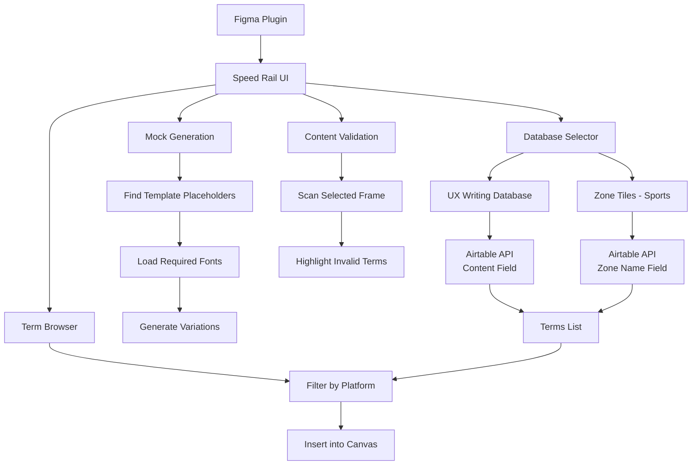

# Speed Rail

A powerful Figma plugin for content design and UX writing teams to maintain consistent, approved language across designs. Speed Rail connects to multiple Airtable databases to provide instant access to approved terms, generate design variations, and validate content against your team's standards.

## 🚀 Features

- **Multi-Database Support**: Switch between UX Writing Database and Zone Tiles - Sports
- **Content Validation**: Scan frames to highlight unapproved terms in red
- **Mock Generation**: Create multiple design variations from templates with dynamic placeholders
- **Platform Filtering**: Filter content by platform (iOS, Android, Web, etc.)
- **Real-time Updates**: Changes in Airtable reflect instantly in Figma
- **Smart Font Loading**: Automatically loads fonts used in templates for mock generation

## 🏗 Architecture



## 📋 Prerequisites

Before installing Speed Rail, ensure you have:

- **Figma Account**: With plugin installation permissions
- **Airtable Access**: API keys and base access for:
  - UX Writing Database (Content, Platform, Examples + Explanation columns)
  - Zone Tiles - Sports (Zone Name, Platform, Examples + Explanation columns)
- **Development Environment**: Node.js and npm (for development only)

## 🛠 Installation Instructions

### For Team Members (Using the Plugin)

1. **Get Plugin Access**
   ```
   Ask your team admin to share the Speed Rail plugin with you in Figma
   ```

2. **Open Figma**
   - Go to any Figma file
   - Navigate to `Plugins` in the menu
   - Find "Speed Rail" in your plugins list

3. **Launch the Plugin**
   - Click on Speed Rail
   - The plugin will automatically load both databases

4. **Start Using**
   - Select database from dropdown (UX Writing Database or Zone Tiles - Sports)
   - Browse terms or use the action buttons

### For Developers (Setting Up Development)

1. **Clone the Repository**
   ```bash
   git clone <repository-url>
   cd writing-on-the-wall
   ```

2. **Install Dependencies** (if any package.json exists)
   ```bash
   npm install
   ```

3. **Configure Database Connections**
   
   Update the database configurations in `code.js`:
   ```javascript
   const DATABASES = {
       commonTerms: {
           apiKey: 'your-ux-writing-api-key',
           baseId: 'your-ux-writing-base-id',
           tableName: 'Common Terms',
           displayName: 'UX Writing Database'
       },
       sportsOnly: {
           apiKey: 'your-sports-api-key', 
           baseId: 'your-sports-base-id',
           tableName: 'Sports Only',
           displayName: 'Zone Tiles - Sports'
       }
   }
   ```

4. **Import into Figma**
   - Open Figma Desktop App
   - Go to `Plugins` → `Development` → `Import plugin from manifest`
   - Select the `manifest.json` file from this project
   - Click "Save"

5. **Test the Plugin**
   - Create a new Figma file
   - Run the plugin from `Plugins` → `Development` → `Speed Rail`

## 📖 Usage Guide

### Basic Workflow

1. **Select Database**
   - Choose "UX Writing Database" for general content terms
   - Choose "Zone Tiles - Sports" for sports-specific zone names

2. **Browse and Insert Terms**
   - View all available terms in the list
   - Filter by platform if needed
   - Click any term to insert it as a text layer

3. **Validate Content**
   - Select a frame containing text
   - Click "🔍 Scan Frame for Invalid Terms"
   - Invalid terms will be highlighted in red

4. **Generate Mocks**
   - Create a template with placeholder text or layer names:
     - UX Writing: `{{Content}}` 
     - Sports: `{{Zone Name}}`
   - Select your template
   - Click "🚀 Generate Mocks from Template"
   - Multiple variations will be created automatically

### Advanced Features

#### Template Placeholders
Speed Rail supports two types of placeholders:

1. **Text Content**: `"Hello {{Zone Name}}"` → `"Hello Penalty Box"`
2. **Layer Names**: Layer named `{{Zone Name}}` → Content becomes `"Penalty Box"`

#### Font Handling
The plugin automatically:
- Detects all fonts used in your template
- Loads them before generating mocks
- Falls back to Inter Regular if fonts fail to load

#### Platform Filtering
- Filter terms by platform (iOS, Android, Web, etc.)
- Platform options are dynamically loaded from your Airtable data
- "All Platforms" option available for UX Writing Database

## 🔧 Configuration

### Airtable Schema

#### UX Writing Database
| Column | Description |
|--------|-------------|
| Content | The approved term/phrase |
| Platform | Target platform (iOS, Android, Web, etc.) |
| Examples + Explanation | Usage context and examples |

#### Zone Tiles - Sports  
| Column | Description |
|--------|-------------|
| Zone Name | The zone/area name |
| Platform | Target platform |
| Examples + Explanation | Usage context and examples |

### Network Access
The plugin requires network access to:
- `https://api.airtable.com` for fetching data

This is configured in `manifest.json`:
```json
"networkAccess": {
  "allowedDomains": [
    "https://api.airtable.com"
  ]
}
```

## 🚨 Troubleshooting

### Common Issues

1. **"No terms found"**
   - Check your Airtable API key and base ID
   - Ensure the table name matches exactly
   - Verify network connectivity

2. **Font loading errors**
   - Plugin will auto-fallback to Inter Regular
   - Check console for specific font names
   - Ensure fonts are available in your Figma file

3. **"No placeholders found"**
   - Check placeholder syntax: `{{Zone Name}}` or `{{Content}}`
   - Verify you're using the correct field name for your database
   - Try using placeholder in layer name instead of text content

4. **Plugin won't load**
   - Refresh Figma
   - Check browser console for errors
   - Verify manifest.json is valid

### Getting Help

For technical issues:
1. Check browser console (F12) for error messages
2. Verify Airtable API access and permissions
3. Test with a simple template first
4. Contact your team's plugin administrator

## 🔄 Updates

When databases are updated in Airtable:
- Changes appear immediately in the plugin (no refresh needed)
- New terms become available for insertion and validation
- Platform filters update automatically

## 📝 Contributing

To modify or extend Speed Rail:

1. Update `code.js` for backend logic
2. Update `ui.html` for interface changes  
3. Update `manifest.json` for plugin settings
4. Test thoroughly with both databases
5. Update this README with any new features

---

**Plugin Version**: 1.0.0  
**Figma API Version**: 1.0.0  
**Last Updated**: 2025