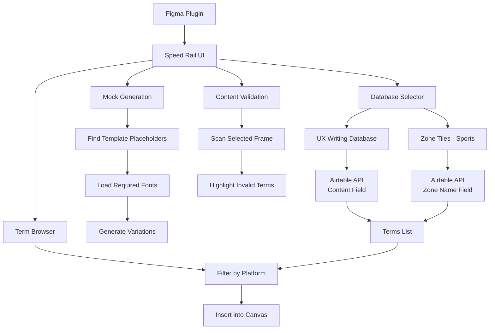

# Speed Rail ⚡

### AI-Powered Content Database for Figma
*Your design system for words.*

Speed Rail is a powerful Figma plugin that helps design teams maintain consistent, approved language across their designs. Built with AI-first principles, Speed Rail connects to databases (Airtable) to provide instant access to approved terms, automatically validate content, and generate design variations with zero manual work.

**The Problem:** Designers waste hours searching for approved copy, unapproved terms slip through to production, and content reviews become bottlenecks.

**The Solution:** Speed Rail delivers approved, compliant copy directly in Figma—with AI-powered suggestions (coming soon), real-time validation, and instant mock generation.

## 🚀 Key Features

### Core Features (Available Now)
- **🤖 AI-Ready Architecture**: Built to support AI-powered content suggestions (roadmap)
- **✅ Content Validation**: Scan frames to highlight unapproved terms in red automatically
- **🎨 Mock Generation**: Create 10, 20, 50+ design variations from one template in seconds
- **📱 Platform Filtering**: Filter content by platform (iOS, Android, Web, etc.)
- **🔄 Real-time Sync**: Changes in your database reflect instantly in Figma
- **🗄️ Multi-Database Support**: Switch between multiple content databases seamlessly
- **🎯 Smart Font Loading**: Automatically loads fonts used in templates for mock generation

### Coming Soon (See [ROADMAP.md](./ROADMAP.md))
- **🤖 AI Content Suggestions**: Context-aware term recommendations based on component type
- **🧠 AI Content Generation**: Generate new approved copy that matches your brand voice
- **📊 Usage Analytics**: Track which terms are used most, identify gaps
- **🌍 Multi-Language AI**: AI-powered translation maintaining brand consistency
- **🔍 Duplicate Detection**: AI identifies similar terms to maintain consistency

## 💡 Why Speed Rail?

### vs. Manual Process (Notion/Confluence Docs)
- ⚡ **10x faster**: No more searching through docs
- ✅ **Validated**: Catch unapproved copy before it ships
- 🎨 **Integrated**: Never leave Figma
- 📊 **Trackable**: See what's actually being used

### vs. Enterprise Tools (Frontitude, Writer.com)
- 💰 **75% cheaper**: $15-49/month vs. $250-2,000/month
- ⏱️ **100x faster setup**: 5 minutes vs. 2-4 weeks
- 🎯 **Design-first**: Built for product designers, not writers
- 🚀 **Mock generation**: Unique feature that saves hours daily

[See full competitive analysis →](./COMPETITIVE_ANALYSIS.md)

## 🏗 Architecture


```mermaid
graph TD
    A[Figma Plugin] --> B[Speed Rail UI]
    B --> C[Database Selector]
    C --> D[UX Writing Database]
    C --> E[Zone Tiles - Sports]
    
    D --> F[Airtable API<br/>Content Field]
    E --> G[Airtable API<br/>Zone Name Field]
    
    B --> H[Content Validation]
    B --> I[Mock Generation]
    B --> J[Term Browser]
    
    H --> K[Scan Selected Frame]
    K --> L[Highlight Invalid Terms]
    
    I --> M[Find Template Placeholders]
    M --> N[Load Required Fonts]
    N --> O[Generate Variations]
    
    J --> P[Filter by Platform]
    P --> Q[Insert into Canvas]
    
    F --> R[Terms List]
    G --> R
    R --> P
```

## 🎬 Demo & Use Cases

### Real-World Impact
- **Before Speed Rail**: Designer spends 15 minutes searching Notion docs for approved button copy, settles on unapproved term, gets flagged in review
- **After Speed Rail**: Designer clicks plugin, sees approved terms, inserts in 5 seconds, validated automatically

### Perfect For
- **Product Designers**: Get approved copy without waiting for content review
- **Content Design Leads**: Scale your team without becoming a bottleneck
- **Design Systems Teams**: Complete your system with a content component
- **Startups**: Move fast without sacrificing consistency
- **Agencies**: Manage copy across multiple client projects

### Demo Video
*Coming soon - see [demo instructions](#usage-guide) to try it yourself*

## 📋 Prerequisites

Before installing Speed Rail, ensure you have:

- **Figma Account**: With plugin installation permissions
- **Airtable Database** (or use our demo database):
  - Required columns: Term field, Platform field, Explanation field
  - Example schema: Content, Platform, Examples + Explanation
- **Development Environment** (for contributors): Node.js and npm

## 🛠 Installation Instructions

### For Team Members (Using the Plugin)

1. **Get Plugin Access**
   ```
   Ask your team admin to share the Speed Rail plugin with you in Figma
   ```

2. **Open Figma**
   - Go to any Figma file
   - Navigate to `Plugins` in the menu
   - Find "Speed Rail" in your plugins list

3. **Launch the Plugin**
   - Click on Speed Rail
   - The plugin will automatically load both databases

4. **Start Using**
   - Select database from dropdown (UX Writing Database or Zone Tiles - Sports)
   - Browse terms or use the action buttons

### For Developers (Setting Up Development)

1. **Clone the Repository**
   ```bash
   git clone <repository-url>
   cd writing-on-the-wall
   ```

2. **Install Dependencies** (if any package.json exists)
   ```bash
   npm install
   ```

3. **Configure Database Connections**
   
   Update the database configurations in `code.js`:
   ```javascript
   const DATABASES = {
       commonTerms: {
           apiKey: 'your-ux-writing-api-key',
           baseId: 'your-ux-writing-base-id',
           tableName: 'Common Terms',
           displayName: 'UX Writing Database'
       },
       sportsOnly: {
           apiKey: 'your-sports-api-key', 
           baseId: 'your-sports-base-id',
           tableName: 'Sports Only',
           displayName: 'Zone Tiles - Sports'
       }
   }
   ```

4. **Import into Figma**
   - Open Figma Desktop App
   - Go to `Plugins` → `Development` → `Import plugin from manifest`
   - Select the `manifest.json` file from this project
   - Click "Save"

5. **Test the Plugin**
   - Create a new Figma file
   - Run the plugin from `Plugins` → `Development` → `Speed Rail`

## 📖 Usage Guide

### Basic Workflow

1. **Select Database**
   - Choose "UX Writing Database" for general content terms
   - Choose "Zone Tiles - Sports" for sports-specific zone names

2. **Browse and Insert Terms**
   - View all available terms in the list
   - Filter by platform if needed
   - Click any term to insert it as a text layer

3. **Validate Content**
   - Select a frame containing text
   - Click "🔍 Scan Frame for Invalid Terms"
   - Invalid terms will be highlighted in red

4. **Generate Mocks**
   - Create a template with placeholder text or layer names:
     - UX Writing: `{{Content}}` 
     - Sports: `{{Zone Name}}`
   - Select your template
   - Click "🚀 Generate Mocks from Template"
   - Multiple variations will be created automatically

### Advanced Features

#### Template Placeholders
Speed Rail supports two types of placeholders:

1. **Text Content**: `"Hello {{Zone Name}}"` → `"Hello Penalty Box"`
2. **Layer Names**: Layer named `{{Zone Name}}` → Content becomes `"Penalty Box"`

#### Font Handling
The plugin automatically:
- Detects all fonts used in your template
- Loads them before generating mocks
- Falls back to Inter Regular if fonts fail to load

#### Platform Filtering
- Filter terms by platform (iOS, Android, Web, etc.)
- Platform options are dynamically loaded from your Airtable data
- "All Platforms" option available for UX Writing Database

## 🔧 Configuration

### Airtable Schema

#### UX Writing Database
| Column | Description |
|--------|-------------|
| Content | The approved term/phrase |
| Platform | Target platform (iOS, Android, Web, etc.) |
| Examples + Explanation | Usage context and examples |

#### Zone Tiles - Sports  
| Column | Description |
|--------|-------------|
| Zone Name | The zone/area name |
| Platform | Target platform |
| Examples + Explanation | Usage context and examples |

### Network Access
The plugin requires network access to:
- `https://api.airtable.com` for fetching data

This is configured in `manifest.json`:
```json
"networkAccess": {
  "allowedDomains": [
    "https://api.airtable.com"
  ]
}
```

## 🚨 Troubleshooting

### Common Issues

1. **"No terms found"**
   - Check your Airtable API key and base ID
   - Ensure the table name matches exactly
   - Verify network connectivity

2. **Font loading errors**
   - Plugin will auto-fallback to Inter Regular
   - Check console for specific font names
   - Ensure fonts are available in your Figma file

3. **"No placeholders found"**
   - Check placeholder syntax: `{{Zone Name}}` or `{{Content}}`
   - Verify you're using the correct field name for your database
   - Try using placeholder in layer name instead of text content

4. **Plugin won't load**
   - Refresh Figma
   - Check browser console for errors
   - Verify manifest.json is valid

### Getting Help

For technical issues:
1. Check browser console (F12) for error messages
2. Verify Airtable API access and permissions
3. Test with a simple template first
4. Contact your team's plugin administrator

## 🔄 Updates

When databases are updated in Airtable:
- Changes appear immediately in the plugin (no refresh needed)
- New terms become available for insertion and validation
- Platform filters update automatically

## 🗺️ Product Roadmap

Speed Rail is actively developed with an ambitious roadmap focused on AI-powered features:

### Phase 1: AI Intelligence Core (Q1 2025)
- AI-powered content suggestions based on design context
- Intelligent content generation following brand voice
- Style guide adherence checking
- Multilingual AI support

### Phase 2: Database & Scalability (Q2 2025)
- Hosted database option (no Airtable required)
- Enhanced caching and performance
- Team collaboration features
- Advanced security (SOC 2)

### Phase 3: Advanced Features (Q3 2025)
- Content design system library
- Version control & history
- Usage analytics dashboard
- Smart duplicate detection

### Phase 4: Enterprise & Integrations (Q4 2025)
- SSO/SAML
- Public API
- Slack, Jira, Notion integrations
- Adobe XD support

[See full roadmap with details →](./ROADMAP.md)

## 💰 Monetization & Pricing (Planned)

Speed Rail will offer a freemium model:

| Tier | Price | Best For | Features |
|------|-------|----------|----------|
| **Free** | $0 | Solo designers, students | 1 database, 100 terms, basic validation |
| **Pro** | $15/mo | Freelancers, small teams | 3 databases, 1,000 terms, basic AI (100/mo) |
| **Team** | $49/mo | Growing teams (5-20) | Unlimited databases, 10k terms, full AI |
| **Enterprise** | Custom | Large orgs (50+) | Custom infrastructure, SSO, SLA |

**Current Status**: Free during development phase

[See monetization strategy →](./ROADMAP.md#monetization-strategy)

## 🎯 Competitive Advantage

Speed Rail is positioned uniquely in the content design tools market:

**🆚 vs. Frontitude**
- 75-95% cheaper
- 100x faster setup (5 minutes vs. weeks)
- Simpler, no enterprise complexity
- Unique mock generation feature

**🆚 vs. Writer.com**
- Design-first (not writing-first)
- Context-aware for UI components
- Mock generation built-in
- More affordable for small teams

**🆚 vs. Manual Process**
- 10x faster than searching docs
- Automated validation
- Never out of date
- Trackable usage

[See full competitive analysis →](./COMPETITIVE_ANALYSIS.md)

## 📝 Contributing

We welcome contributions! To modify or extend Speed Rail:

1. Fork the repository
2. Create a feature branch (`git checkout -b feature/amazing-feature`)
3. Make your changes:
   - Update `code.js` for backend logic
   - Update `ui.html` for interface changes
   - Update `manifest.json` for plugin settings
4. Test thoroughly with both databases
5. Update documentation (README, ROADMAP, etc.)
6. Submit a pull request

### Development Priorities
- AI integration (OpenAI/Anthropic APIs)
- Performance optimization
- Additional database connectors
- Analytics dashboard

## 📄 License

[Add your license here - MIT recommended for open source]

## 🤝 About This Project

Speed Rail was created to demonstrate:
- **AI Integration**: How to leverage AI APIs in real-world applications
- **Product Thinking**: Identifying pain points and building solutions
- **Modern Development**: Best practices in plugin development
- **Business Acumen**: Market analysis, competitive positioning, monetization

**Built for the Design Nurse demo** to showcase the ability to identify market opportunities, build working prototypes, and think strategically about product development.

---

**Plugin Version**: 1.0.0
**Figma API Version**: 1.0.0
**Status**: Active Development
**Last Updated**: January 2025

## 📚 Additional Resources

- [Product Roadmap](./ROADMAP.md) - Detailed feature timeline and technical specs
- [Competitive Analysis](./COMPETITIVE_ANALYSIS.md) - Market landscape and positioning
- [Issues](https://github.com/your-repo/issues) - Report bugs or request features

## 🙋 Support & Contact

- **Issues**: [GitHub Issues](https://github.com/your-repo/issues)
- **Discussions**: [GitHub Discussions](https://github.com/your-repo/discussions)
- **Email**: [your-email@example.com]

---

⭐ Star this repo if you find it useful!
💬 [Share feedback](https://github.com/your-repo/issues/new) - we're actively developing based on user input