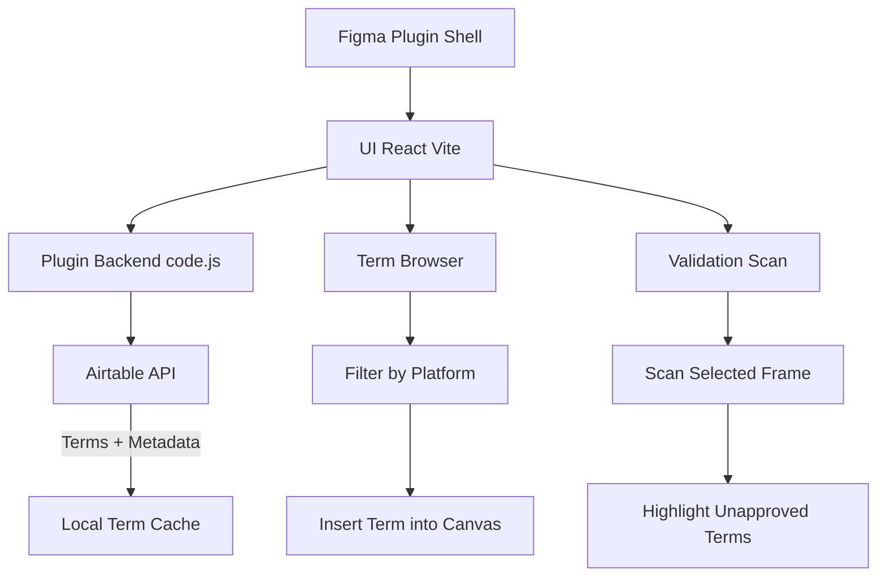

# Speed Rail ⚡

### AI-Powered Content Database for Figma
*Your design system for words.*

Speed Rail is a powerful Figma plugin that helps design teams maintain consistent, approved language across their designs. Built with AI-first principles, Speed Rail connects to databases (Airtable) to provide instant access to approved terms and automatically validate content.

**The Problem:** Designers waste hours searching for approved copy, unapproved terms slip through to production, and content reviews become bottlenecks.

**The Solution:** Speed Rail delivers approved, compliant copy directly in Figma—with AI-powered suggestions (coming soon) and real-time validation.

## 🚀 Key Features

### Core Features (Available Now)
- **🤖 AI-Ready Architecture**: Built to support AI-powered content suggestions (roadmap)
- **✅ Content Validation**: Scan frames to highlight unapproved terms in red automatically
- **📱 Platform Filtering**: Filter content by platform (iOS, Android, Web, etc.)
- **🔄 Real-time Sync**: Changes in your database reflect instantly in Figma
- **🗄️ Multi-Database Support**: Switch between multiple content databases seamlessly

### Coming Soon (See [ROADMAP.md](./ROADMAP.md))
- **🤖 AI Content Suggestions**: Context-aware term recommendations based on component type
- **🧠 AI Content Generation**: Generate new approved copy that matches your brand voice
- **📊 Usage Analytics**: Track which terms are used most, identify gaps
- **🌍 Multi-Language AI**: AI-powered translation maintaining brand consistency
- **🔍 Duplicate Detection**: AI identifies similar terms to maintain consistency

## 💡 Why Speed Rail?

### vs. Manual Process (Notion/Confluence Docs)
- ⚡ **10x faster**: No more searching through docs
- ✅ **Validated**: Catch unapproved copy before it ships
- 🎨 **Integrated**: Never leave Figma
- 📊 **Trackable**: See what's actually being used

### vs. Enterprise Tools (Frontitude, Writer.com)
- 💰 **75% cheaper**: $15-49/month vs. $250-2,000/month
- ⏱️ **100x faster setup**: 5 minutes vs. 2-4 weeks
- 🎯 **Design-first**: Built for product designers, not writers

[See full competitive analysis →](./COMPETITIVE_ANALYSIS.md)

## 🏗 Architecture

### Tech Stack
- **Frontend UI**: React 18 + TypeScript + Vite
- **Plugin Backend**: Figma Plugin API (JavaScript)
- **Database**: Airtable (REST API)
- **Build Tool**: Vite with single-file bundling
- **Styling**: CSS with custom properties

### System Architecture


```mermaid
graph TD
    A[Figma Plugin Shell] --> B[UI React Vite]
    B --> C[Plugin Backend code.js]
    C --> D[Airtable API]
    D -->|Terms + Metadata| E[Local Term Cache]
    B --> F[Term Browser]
    B --> G[Validation Scan]
    F --> H[Filter by Platform]
    H --> I[Insert Term into Canvas]
    G --> J[Scan Selected Frame]
    J --> K[Highlight Unapproved Terms]
```

### File Structure
```
design-system-writing-database/
├── src/                     # React UI source files
│   ├── App.tsx             # Main application component
│   ├── App.css             # Global styles
│   ├── types.ts            # TypeScript interfaces
│   └── components/         # React components
│       ├── ActionButtons.tsx
│       ├── PlatformFilter.tsx
│       ├── TermsList.tsx
│       └── ValidationDisplay.tsx
├── code.js                 # Plugin backend (gitignored)
├── code.template.js        # Template for code.js
├── manifest.json           # Figma plugin manifest
├── ui.html                 # Built UI (generated)
├── build.js                # Build script
└── vite.config.ts          # Vite configuration
```

## 🎬 Demo & Use Cases

### Real-World Impact
- **Before Speed Rail**: Designer spends 15 minutes searching Notion docs for approved button copy, settles on unapproved term, gets flagged in review
- **After Speed Rail**: Designer clicks plugin, sees approved terms, inserts in 5 seconds, validated automatically

### Perfect For
- **Product Designers**: Get approved copy without waiting for content review
- **Content Design Leads**: Scale your team without becoming a bottleneck
- **Design Systems Teams**: Complete your system with a content component
- **Startups**: Move fast without sacrificing consistency
- **Agencies**: Manage copy across multiple client projects

### Demo Video
*Coming soon - see [demo instructions](#usage-guide) to try it yourself*

## 📋 Prerequisites

Before installing Speed Rail, ensure you have:

- **Figma Account**: With plugin installation permissions
- **Airtable Database** (or use our demo database):
  - Required columns: Term field, Platform field, Explanation field
  - Example schema: Content, Platform, Examples + Explanation
- **Development Environment** (for contributors): Node.js and npm

## 🛠 Quick Setup (New Machine)

1) **Install dependencies**
```bash
npm install
```

2) **Create your local secret file**
```bash
cp code.template.js code.js
```
Open `code.js` and replace:
- `{{AIRTABLE_PAT}}` → your Airtable Personal Access Token (starts with `pat`)
- `{{AIRTABLE_BASE_ID}}` → your Airtable Base ID (starts with `app`)

3) **Build the plugin UI**
```bash
npm run build
```
This creates `ui.html` that Figma uses.

4) **Load in Figma**
- Open Figma Desktop
- `Plugins → Development → Import plugin from manifest`
- Choose this repo’s `manifest.json`
- Launch the plugin

### Troubleshooting
- **`tsc: command not found`** → Run `npm install` to install TypeScript.
- **`code.js not found`** → Make sure you ran `cp code.template.js code.js` and filled in your keys.
- **No data shows** → Double-check `tableName` and field names in `code.js` match your Airtable.

**Tip:** After making code changes, rerun `npm run build` and reload the plugin in Figma.

## 📖 Usage Guide

### Basic Workflow

1. **Browse and Insert Terms**
   - View all available approved UX writing terms in the list
   - Filter by platform if needed
   - Click any term to insert it as a text layer

2. **Validate Content**
   - Select a frame containing text
   - Click "🔍 Scan Frame for Invalid Terms"
   - Invalid terms will be highlighted in red
   - Click "Go to layer" next to any invalid term to jump directly to that text layer in Figma

### Advanced Features

#### Platform Filtering
- Filter terms by platform (iOS, Android, Web, etc.)
- Platform options are dynamically loaded from your Airtable data
- "All Platforms" option shows all approved terms

#### Search
- Use the search box to filter terms by content, explanation, type, or platform while you browse.

## 🔧 Configuration

### Airtable Schema

Your Airtable table should have the following columns:

| Column | Type | Description |
|--------|------|-------------|
| Content | Single line text | The approved term/phrase |
| Platform | Multiple select | Target platform(s): iOS, Android, Web, etc. |
| Examples & Explanation | Long text | Usage context and examples |

> **Note**: The Platform field should be a "Multiple select" type in Airtable to support terms that apply to multiple platforms.

### Network Access
The plugin requires network access to:
- `https://api.airtable.com` for fetching content data
- `https://fonts.googleapis.com` for loading custom fonts

This is configured in `manifest.json`:
```json
"networkAccess": {
  "allowedDomains": [
    "https://api.airtable.com",
    "https://fonts.googleapis.com"
  ]
}
```

### Document Access
The plugin uses `"documentAccess": "dynamic-page"` which allows it to:
- Access nodes across different pages dynamically
- Navigate to and select specific text layers
- Required for the "Go to layer" feature

> **Note**: This requires using async APIs like `figma.getNodeByIdAsync()` instead of synchronous methods.

## 🚨 Troubleshooting

### Common Issues

1. **"No terms found"**
   - Check your Airtable API key and base ID
   - Ensure the table name matches exactly
   - Verify network connectivity

2. **Font loading errors**
   - Plugin will auto-fallback to Inter Regular
   - Check console for specific font names
   - Ensure fonts are available in your Figma file

3. **"No placeholders found"**
   - Check placeholder syntax: `{{Content}}`
   - Verify you're using the correct placeholder syntax
   - Try using placeholder in layer name instead of text content

4. **Plugin won't load**
   - Ensure you've run `npm run build` to compile the UI
   - Refresh Figma (close and reopen the plugin)
   - Check browser console (F12) for errors
   - Check plugin console (Plugins → Development → Open Console)
   - Verify manifest.json is valid JSON

5. **"Go to layer" button doesn't work**
   - Make sure you've reloaded the plugin after running `npm run build`
   - Check the plugin console for error messages
   - Verify the text layer still exists in your document

### Getting Help

For technical issues:
1. Check **browser console** (F12) for UI-related error messages
2. Check **plugin console** (Plugins → Development → Open Console) for plugin code errors
3. Verify Airtable API access and permissions
4. Ensure you've run `npm run build` after code changes
5. Test with a simple template first
6. Contact your team's plugin administrator

## 🔄 Updates

When databases are updated in Airtable:
- Changes appear immediately in the plugin (no refresh needed)
- New terms become available for insertion and validation
- Platform filters update automatically

## 🗺️ Product Roadmap

Speed Rail is actively developed with an ambitious roadmap focused on AI-powered features:

### Phase 1: AI Intelligence Core (Q1 2025)
- AI-powered content suggestions based on design context
- Intelligent content generation following brand voice
- Style guide adherence checking
- Multilingual AI support

### Phase 2: Database & Scalability (Q2 2025)
- Hosted database option (no Airtable required)
- Enhanced caching and performance
- Team collaboration features
- Advanced security (SOC 2)

### Phase 3: Advanced Features (Q3 2025)
- Content design system library
- Version control & history
- Usage analytics dashboard
- Smart duplicate detection

### Phase 4: Enterprise & Integrations (Q4 2025)
- SSO/SAML
- Public API
- Slack, Jira, Notion integrations
- Adobe XD support

[See full roadmap with details →](./ROADMAP.md)

## 💰 Monetization & Pricing (Planned)

Speed Rail will offer a freemium model:

| Tier | Price | Best For | Features |
|------|-------|----------|----------|
| **Free** | $0 | Solo designers, students | 1 database, 100 terms, basic validation |
| **Pro** | $15/mo | Freelancers, small teams | 3 databases, 1,000 terms, basic AI (100/mo) |
| **Team** | $49/mo | Growing teams (5-20) | Unlimited databases, 10k terms, full AI |
| **Enterprise** | Custom | Large orgs (50+) | Custom infrastructure, SSO, SLA |

**Current Status**: Free during development phase

[See monetization strategy →](./ROADMAP.md#monetization-strategy)

## 🎯 Competitive Advantage

Speed Rail is positioned uniquely in the content design tools market:

**🆚 vs. Frontitude**
- 75-95% cheaper
- 100x faster setup (5 minutes vs. weeks)
- Simpler, no enterprise complexity

**🆚 vs. Writer.com**
- Design-first (not writing-first)
- Context-aware for UI components
- Built into Figma for instant insert/validate
- More affordable for small teams

**🆚 vs. Manual Process**
- 10x faster than searching docs
- Automated validation
- Never out of date
- Trackable usage

[See full competitive analysis →](./COMPETITIVE_ANALYSIS.md)

## 📝 Contributing

We welcome contributions! To modify or extend Speed Rail:

1. Fork the repository
2. Create a feature branch (`git checkout -b feature/amazing-feature`)
3. Make your changes:
   - Update `code.js` for plugin logic (Figma API interactions)
   - Update React components in `src/` for UI changes
   - Update `manifest.json` for plugin settings
   - Run `npm run build` to compile changes
4. Test thoroughly:
   - Test with different platforms and terms
   - Check both browser console and plugin console for errors
   - Verify changes work after plugin reload
5. Update documentation (README, ROADMAP, etc.)
6. Submit a pull request

### Development Priorities
- AI integration (OpenAI/Anthropic APIs)
- Performance optimization
- Additional database connectors
- Analytics dashboard

## 📄 License

[Add your license here - MIT recommended for open source]

## 🤝 About This Project

Speed Rail was created to demonstrate:
- **AI Integration**: How to leverage AI APIs in real-world applications
- **Product Thinking**: Identifying pain points and building solutions
- **Modern Development**: Best practices in plugin development
- **Business Acumen**: Market analysis, competitive positioning, monetization

**Built for the Design Nurse demo** to showcase the ability to identify market opportunities, build working prototypes, and think strategically about product development.

---

**Plugin Version**: 1.0.0
**Figma API Version**: 1.0.0
**Status**: Active Development
**Last Updated**: January 2025

## 📚 Additional Resources

- [Product Roadmap](./ROADMAP.md) - Detailed feature timeline and technical specs
- [Competitive Analysis](./COMPETITIVE_ANALYSIS.md) - Market landscape and positioning
- [Issues](https://github.com/your-repo/issues) - Report bugs or request features

## 🙋 Support & Contact

- **Issues**: [GitHub Issues](https://github.com/your-repo/issues)
- **Discussions**: [GitHub Discussions](https://github.com/your-repo/discussions)
- **Email**: [your-email@example.com]

---

⭐ Star this repo if you find it useful!
💬 [Share feedback](https://github.com/your-repo/issues/new) - we're actively developing based on user input
